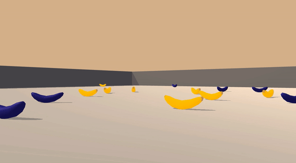

# Project 1: Navigation
This is one of my Udacity Deep Reinforcement Learning Nanodegree projects. Most codes are referred to what I've learned from the course.

## Introduction

For this project, we will train an agent to navigate and collect bananas!



A reward of +1 is given if a yellow banana is collected, and a reward of -1 if a blue banana is.  Our goal is to collect as many yellow bananas as possible and to avoid blue bananas.

The state space is consisted of 37 dimensions, agent's velocity, , directions, and so on.  The agent has four discrete actions, `0`-move forward, `1`-move backward, `2`-turn left, and `3`-turn right.

The task is episodic. The goal is to train the agent to get an average score of +13 over 100 consecutive episodes.

## Getting Started

1. Create (and activate) a new environment with Python 3.6.
    - __Linux__ or __Mac__: 
        ```bash
        conda create --name drlnd python=3.6
        source activate drlnd
        ```
    - __Windows__: 
        ```bash
        conda create --name drlnd python=3.6 
        activate drlnd
        ```

2. Clone this repository and navigate to the `python/` folder.  Then, install several dependencies.
    ```bash
    git clone https://github.com/nithiroj/drlnd-navigation.git
    cd drlnd-navigation/python
    pip install .
    ```

3. Download the environment that matches your operating system, place it in `drlnd-navigation/` folder, and unzip it.
    - Linux: [click here](https://s3-us-west-1.amazonaws.com/udacity-drlnd/P1/Banana/Banana_Linux.zip)
    - Mac OSX: [click here](https://s3-us-west-1.amazonaws.com/udacity-drlnd/P1/Banana/Banana.app.zip) (Banana.app already in this repository)
    - Windows (32-bit): [click here](https://s3-us-west-1.amazonaws.com/udacity-drlnd/P1/Banana/Banana_Windows_x86.zip)
    - Windows (64-bit): [click here](https://s3-us-west-1.amazonaws.com/udacity-drlnd/P1/Banana/Banana_Windows_x86_64.zip)

## Training Instructions
In this repository, there are four trained algorithms-**basic or vanila DQN** (`basic.pth`), **double DQN**(`double.pth`), **dueling DQN**(`dueling.pth`), or both **double and dueling DQN**(`double_dueling.pth`).  The trained models and results (graph and scores) have been provided in `model/` and `report/` respectively.

You can retrain or train these models with your own hyperparameters.  **Please be notices that our provided models and results will be replaced accordingly**. Just make the copies if you want to keep ours.

### Option 1
Follow the instructions in `Navigation.ipynb` to get started with training your own agent!

### Option 2
Run command line on your terminal. Define `--env_file` if it's not `Banana.app`.
```bash
python navigation.py                     # to train with basic DQN model
python navigation.py --double            # to train with double DQN model
python navigation.py --dueling           # to train with dueling DQN model
python navigation.py --double --dueling  # both double and dueling DQN model

optional arguments:
  -h, --help           show this help message and exit
  --play_eps PLAY_EPS  Train if 0 else play episodes, default 0
  --env_file ENV_FILE  Unity environment binary file, default Banana.app
  --dueling            Enable dueling DQN
  --double             Enable double DQN
```

## Watch our smart agents
To watch how the agent performs, define the number of playing episodes `--play_eps` and the agent you prefer. For eaxmple, to watch a double-DQN agent play for two episodes:
```bash
python navigation.py --double --play_eps 2
```
## More informations
You can find more detais in implementation-algorithms (DQN and extensions), model architectures,and choosen hyperparameters-and the achieved rewards in [Report.md](./Report.md).