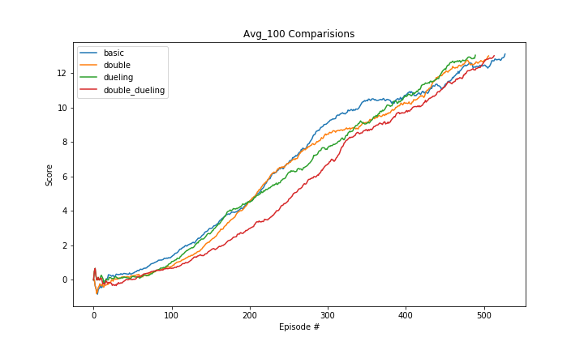

# REPORT Project 1: Navigation

## Learning Algorithms

### Deep Q-Learning (DQN)
- Initialize replay memory
    
$$x_{1,2} = {-b\pm\sqrt{b^2 - 4ac} \over 2a}.$$
### double DQN
$$ \begin{equation} \label{label} ... \end{equation} $$

### dueling DQN

### Model Architects

**Basic DQN**

**Dueling DQN**

## Rewards

## What's Next?

